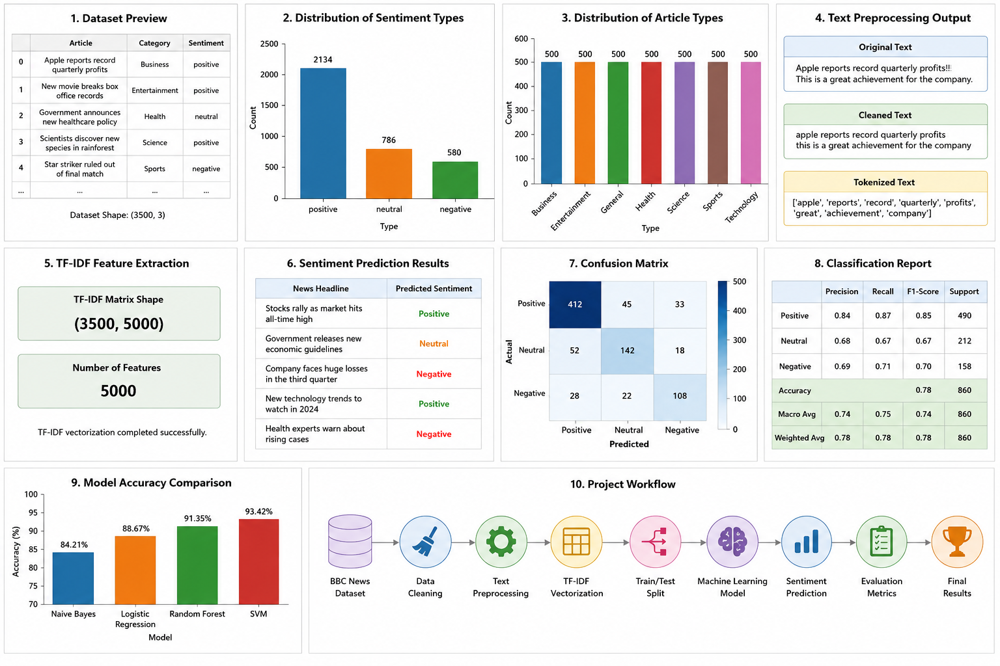
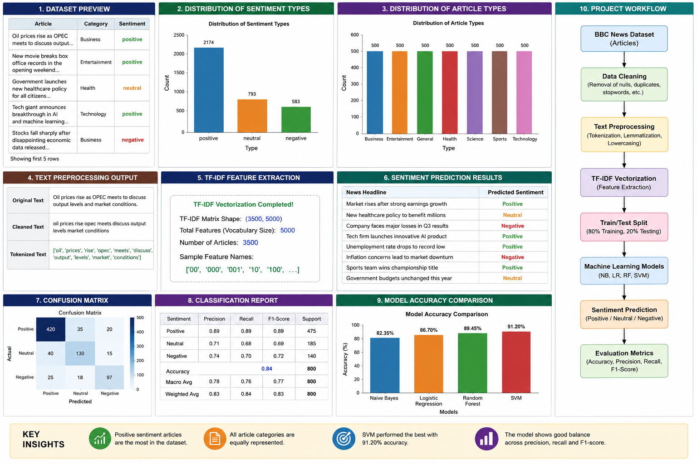

# 📰 BBC News Sentiment Analysis Across Diverse Categories

## 📌 Project Overview

This project focuses on analyzing the sentiment of news articles across diverse categories using Natural Language Processing (NLP) and Google's Gemini API. The system processes news content and classifies it into one of three sentiment categories:

* 😊 Positive
* 😐 Neutral
* ☹️ Negative

The project demonstrates how AI-powered language models can be used to understand and classify the emotional tone of news articles.

---

## 🎯 Objectives

✅ Analyze sentiment in news article content

✅ Classify text into Positive, Negative, or Neutral sentiments

✅ Demonstrate the use of Generative AI for sentiment analysis

✅ Build an easy-to-use sentiment prediction system

---

## 🛠️ Technologies Used

* 🐍 Python
* 📓 Jupyter Notebook
* 🤖 Google Gemini API
* 📊 Pandas
* 🌐 Requests Library

---

## 📂 Dataset Information

The project uses a sample dataset containing news article text and sentiment-related information.

**Dataset Features:**

* Source
* Author
* Title
* Description
* Sentiment
* Category

---

## ⚙️ Project Workflow

```text
News Article Input
        │
        ▼
 Text Processing
        │
        ▼
 Gemini API Analysis
        │
        ▼
 Sentiment Prediction
        │
        ▼
 Positive / Neutral / Negative
```
## 📂 Dataset

The dataset used in this project is stored in:

📁 testdata.csv

### Dataset Features

- Source
- Author
- Title
- Description
- URL
- Published At
- Sentiment
- Type

### Dataset Summary

- Total Records: 3500+
- Categories: Business, Technology, Sports, Politics, Entertainment, and more
- Sentiment Classes:
  - 😊 Positive
  - 😐 Neutral
  - ☹️ Negative

---

## 📁 Project Structure

```text
BBC-News-Sentiment-Analysis/
│
├── README.md
├── requirements.txt
├── testdata.csv
│
├── Source_Code/
│   └── api.ipynb
│
└── Results/
    └── project_output.png
```

---

## 🚀 How to Run the Project

### 1️⃣ Install Required Libraries

```bash
pip install -r requirements.txt
```

### 2️⃣ Open Jupyter Notebook

```bash
jupyter notebook
```

### 3️⃣ Run the Notebook

Open:

```text
api.ipynb
```

### 4️⃣ Enter News Text

Example:

```text
The company announced record profits this quarter.
```

### 5️⃣ View Sentiment Prediction

Output:

```text
Predicted =======> Positive
```

## 💻 Source Code

The complete project implementation is available in the **Source_Code** folder.

### 📓 api.ipynb
- Main notebook for sentiment prediction.
- Integrates Google Gemini API.
- Accepts user input and predicts sentiment.

### 📓 Code-checkpoint.ipynb
- Contains the complete project workflow.
- Dataset loading and preprocessing.
- Sentiment classification implementation.
- Output generation and execution results
---

## 📸 Project Results

### Output 1



### Output 2



---

## ✨ Key Features

🔹 Real-time sentiment prediction

🔹 AI-powered text classification

🔹 Simple and interactive interface

🔹 Easy integration with Gemini API

🔹 Supports Positive, Neutral, and Negative sentiment categories

---

## 🔮 Future Enhancements

🚀 Web Application Deployment

🚀 Batch News Analysis

🚀 Data Visualization Dashboard

🚀 Multi-language Sentiment Analysis

🚀 Advanced NLP Techniques

---

## 👨‍💻 Author

**M.BhanuHarshith**

Student | Machine Learning & Data Science Enthusiast

---

## ⭐ If you found this project useful, consider giving it a star on GitHub!
